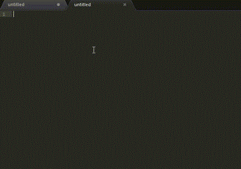

# Sublime Text2 常用英文单词中英互译插件包



三个压缩文件：

* 英文翻译成中文，附带详细释义以及近义词 [sublime-en2zh.zip](https://github.com/Gaubee/blog/raw/gh-pages/Sublime%20Text2%20en2zh%26zh2en/sublime-en2zh.zip)

* 中文翻译成英文，纯小写拼音 [sublime-zh2en.lowercase.zip](https://github.com/Gaubee/blog/raw/gh-pages/Sublime%20Text2%20en2zh%26zh2en/sublime-zh2en.lowercase.zip)

* 中文翻译成英文，声母大写 [sublime-zh2en.zip](https://github.com/Gaubee/blog/raw/gh-pages/Sublime%20Text2%20en2zh%26zh2en/sublime-zh2en.zip)

根据需求下载插件包，复制或剪切到：
```
    系统用户数据文件夹(eg:C:\Users\Gaubee\AppData)\Roaming\Sublime Text 2\Packages
```
并解压

**注意：压缩包内已经有一层文件夹，所以解压的时候直接选择解压到当前文件夹**